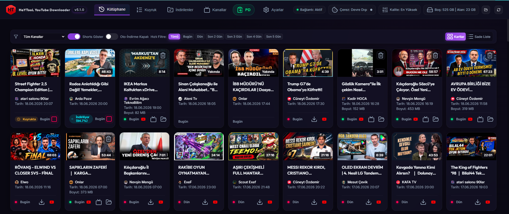
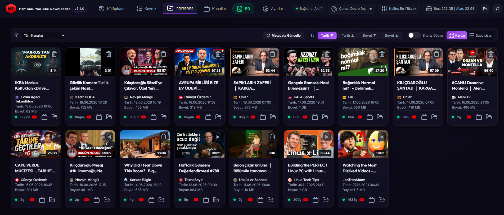
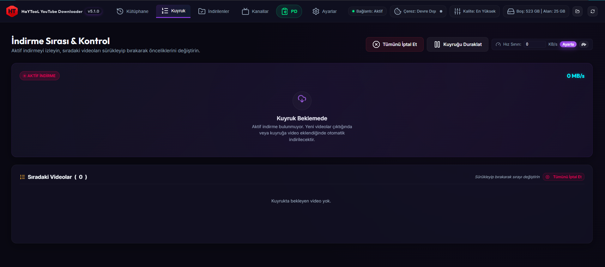
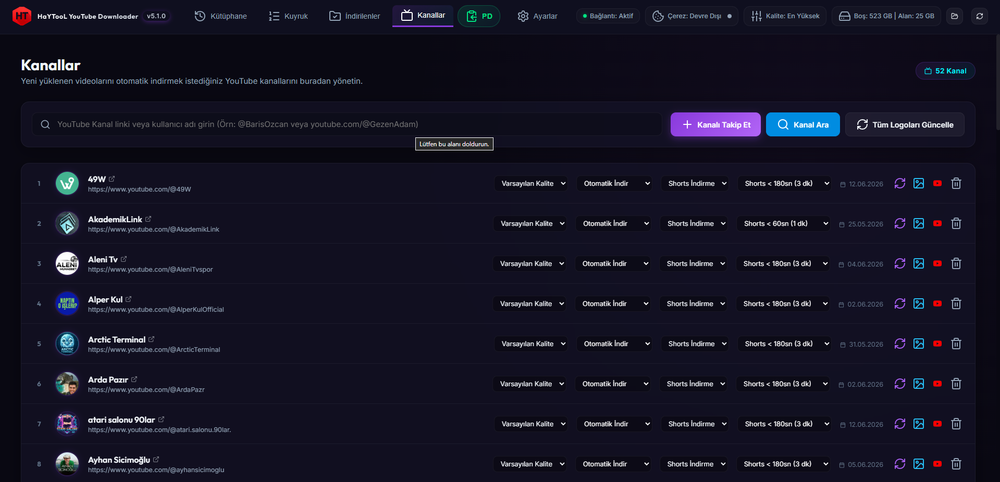
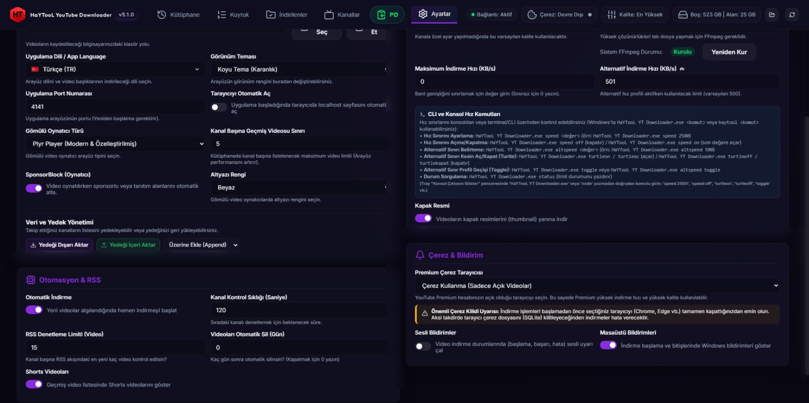

<p align="center">
  
</p>

# <p align="center">📥 Multimedia HaYTooL - Personal YouTube Library & Automation System (v9.8.30)</p>

<p align="center">
  <b>Reclaim Your Feed: An Advanced, Portable, and Zero-Dependency YouTube Automation System & Native Player</b><br/>
  <i>Algoritma Dayatmalarından Kurtulun: Gelişmiş, Taşınabilir ve Otomatik YouTube Takip, İndirme & Yerel Oynatıcı Sistemi</i>
</p>

<p align="center">
  <a href="#-english-version"><b>🇬🇧 English Version</b></a> | <a href="#-türkçe-versiyon"><b>🇹🇷 Türkçe Versiyon</b></a> | <a href="https://haytokoraz.github.io/haytool-youtube-download/" target="_blank"><b>🌐 Official Website</b></a> | <a href="https://haytokoraz.github.io/" target="_blank"><b>🌟 All Apps / Tüm Uygulamalar</b></a>
</p>

<p align="center">
  
  
  
  
  <br>
  
  
  
  
  
  
  <a href="https://haytokoraz.github.io/" target="_blank"></a>
</p>

---

# 🇬🇧 English Version

## 🎯 Core Philosophy

YouTube's recommendation algorithms are designed to maximize watch time by pushing distracting, addictive, and unwanted content to your feed. **Multimedia HaYTooL** is built to break this cycle. 
Instead of logging into YouTube and exposing your data to ads and algorithmic traps, **Multimedia HaYTooL** acts as your private offline library. You define the exact channels you want to follow. The system continuously runs in the background, monitors their RSS feeds, and automatically downloads new videos as soon as they are uploaded. You watch your chosen content locally, 100% ad-free, offline, and entirely on your own terms.

---

<p align="center">
  <b>📸 Application Screenshots</b>
</p>
<p align="center">
  
  
</p>
<p align="center">
  
  
  
</p>

---

## 🚀 Key Features

* **Background Subscription Automation:** Periodically checks your followed channels via RSS feeds. Downloads new videos automatically the second they are uploaded, creating an offline, local cache of your subscription box.
* **Algorithmic Liberation:** No distraction, no "Up Next" traps, and no algorithmic rabbit holes. You only see the videos published by the creators you specifically subscribed to.
* **100% Ad-Free Local Playback:** Plays downloaded videos locally inside a custom dashboard using premium players (Artplayer, Plyr, or HTML5) with full seeking, speed control, and orientation-aware resizing.
* **SponsorBlock Integration:** Automatically skips sponsor segments, intros, outros, and subscription reminders. Includes a session-based shield toggle button under the player and dimmed segments on the timeline.
* **Advanced Subtitles & Translation:** Automatically grabs English/Turkish subtitles. Features a translation utility supporting 11 target languages with a visual loading overlay, along with customizable subtitle styling (12 colors, 12 background opacities, 13 font sizes).
* **YouTube-Style Split Playlist View:** The "Downloads" tab features a dual-column layout. Watch the active video on the left while browsing your other downloads in a sidebar playlist on the right, supporting autoplay (sequential video playback) and status HUD overlays.
* **Per-Channel Download Rules:** Customize download preferences for each channel individually: toggle auto-download, set duration filters, and allow/restrict downloading vertical YouTube Shorts.
* **Windows System Tray & Interactive Terminal Console:** Runs silently in the background with a Windows Tray Icon. Right-click to navigate, toggle speed limits, or control Discord activity. The console window features a command input field piping stdin controls directly (`ton`, `toff`, `status`, `pd <link>`).
* **Single-Instance Mutex Lock:** Prevents running multiple application processes. Launching a second instance prompts an alert, opens the active dashboard in your browser, and exits.
* **Discord Rich Presence (RPC):** Integrates directly with Discord using Windows Named Pipe IPC to display the watched video's channel name on the `details` line and the video title as the `state`. Can be toggled in settings and tray.
* **Dual-Boot isolated Configs:** Isolates OS-specific parameters (`configwin.ini` / `configunix.ini`). Prevents file loss on dual-boot setups; missing files are flagged as `fileMissing: true` and automatically restored if they reappear without breaking DB history.
* **Zero-Dependency Startup:** Pre-packaged with `node_modules/`, `yt-dlp/`, and `ffmpeg/`. Works fully out of the box without external setups.
* **APE Tool (Mark as Watched):** Paste any video or channel link to instantly mark videos as watched/hidden in your library and sync them to your real YouTube watch history. Works for followed channels, previously downloaded channels, and even completely foreign channels (fetches the last N videos and marks them in the background, 1-200 adjustable).
* **YouTube Watch History Sync:** While watching locally, your playback position is periodically synced to your actual YouTube watch history (30s interval + on pause/close). Deleting a video with "also mark as watched" uses the real video duration, so YouTube shows it as fully watched — not just appended to history.
* **WebView2 Built-in Cookie System:** Session cookies are captured from the built-in WebView2 player window — no browser extensions or third-party cookie files needed. Use "Sign in to YouTube" from the tray or Settings to log in securely inside the app; cookies are kept alive with automatic background refresh.

---

## 🛠️ Installation & Running

Since all dependencies (`node_modules/`, `yt-dlp`, `ffmpeg`) are already pre-packaged in the repository, you can run the application immediately after downloading.

### 
* **Double-click Launch:**
  Double-click `Multimedia HaYTooL.exe` in the root folder to start the application silently in the system tray and open the dashboard in your browser.
* **Native Desktop & Media Player Window:**
  Double-click `HaYTooL-Player.exe` to open the application in a dedicated native window (bypassing Chrome/Edge). Playing any downloaded video inside this window opens our integrated high-performance Plyr player to watch files directly from disk (zero-stream lag) with local subtitle base64 auto-loading, double-click fullscreen, mouse wheel volume control, and resume-playback memory.
* **Command Line Launch:**
  ```cmd
  "Multimedia HaYTooL.exe"
  ```

###  /  (Unix)
1. **Make Launcher Executable:**
   ```bash
   chmod +x baslat.sh
   ```
2. **Start the Application:**
   ```bash
   ./baslat.sh
   ```

Access the dashboard at [http://localhost:4141](http://localhost:4141) *(default port can be changed in Settings)*.

---

## 🎹 Keyboard Shortcuts

When the video player is focused, you can control playback using standard shortcuts:

* **`Space`** or **`k` / `K`**: Play - Pause
* **`f` / `F`**: Toggle fullscreen
* **`m` / `M`**: Mute / Unmute
* **`Arrow Right`**: Seek forward 5s
* **`Arrow Left`**: Seek backward 5s
* **`l` / `L`**: Seek forward 10s
* **`j` / `J`**: Seek backward 10s
* **`Arrow Up`**: Volume +5%
* **`Arrow Down`**: Volume -5%
* **`Home`**: Jump to start
* **`End`**: Jump to end
* **`>`** or **`Shift + .`**: Increase speed (up to 2x)
* **`<`** or **`Shift + ,`**: Decrease speed
* **`0` - `9`**: Jump to video percentage (e.g. 5 jumps to 50%)

---

## 💻 CLI & Console Commands

You can manage download queues, speeds, and background profiles directly through the CLI using `"Multimedia HaYTooL.exe"` or via the interactive Console Input at the bottom of the System Tray log window:

| Command | Arguments | Description | Example |
| :--- | :--- | :--- | :--- |
| `pd` | `<youtube-url>` | Instantly downloads video/playlist and adds it to queue | `"Multimedia HaYTooL.exe" pd https://www.youtube.com/watch?v=dQw4w9WgXcQ` |
| `status` | - | Shows active download queue, current limits, and Turtle mode | `"Multimedia HaYTooL.exe" status` |
| `ton` | - | Enables Turtle Mode (Alternative speed limit profile) | `"Multimedia HaYTooL.exe" ton` |
| `toff` | - | Disables Turtle Mode (Returns to normal speed limit) | `"Multimedia HaYTooL.exe" toff` |
| `toggle` | - | Switches between normal and Turtle speed modes | `"Multimedia HaYTooL.exe" toggle` |
| `speed` | `<kb\|off>` | Sets standard download speed limit in KB/s (or disable) | `"Multimedia HaYTooL.exe" speed 2500` |
| `altspeed`| `<kb>` | Sets turtle mode speed limit value in KB/s | `"Multimedia HaYTooL.exe" altspeed 500` |
| `clear` | - | Clears the on-screen log window in the Tray console | `clear` |
| `help` | - | Displays full list of available commands and parameters | `help` |

**CLI Usage Examples:**
```cmd
:: Download a video directly via Windows Command Prompt / PowerShell:
"Multimedia HaYTooL.exe" pd "https://www.youtube.com/watch?v=example"

:: Check server status and active downloads:
"Multimedia HaYTooL.exe" status

:: Enable turtle speed mode (e.g. while gaming or streaming):
"Multimedia HaYTooL.exe" ton

:: Set custom download speed limit to 3000 KB/s:
"Multimedia HaYTooL.exe" speed 3000
```

---

## 📂 Configuration Files

* **`configwin.ini`:** Windows-specific parameters (download path, port, alternative speed toggle).
* **`configunix.ini`:** Linux/macOS-specific parameters.
* **`channels.ini`:** Monitored channels list and their download rules.
* **`db.json`:** Lightweight local database storing download history, queue state, and metadata.

---

## 📞 Support & Feedback

* **Main Portal (All Apps):** [haytokoraz.github.io](https://haytokoraz.github.io/)
* **Email:** `korazhayto@gmail.com`
* **X (Twitter):** [HaYTo](https://x.com/HaYTo)
* **GitHub:** [haytool-youtube-download](https://github.com/HaYToKoRaZ/haytool-youtube-download)

*Developer & Designer:* **HaYTo**

---
---

# 🇹🇷 Türkçe Versiyon

## 🎯 Temel Felsefe

YouTube'un öneri algoritmaları, dikkatinizi dağıtmak, sizi platformda bağımlı kılmak ve istemediğiniz içerikleri önünüze çıkarmak üzerine tasarlanmıştır. **HaYTooL** bu dayatmayı yıkmak için geliştirildi.
YouTube'a girip reklam tuzağına ve algoritma önerilerine maruz kalmak yerine, **HaYTooL** size özel bağımsız bir kütüphane sunar. Sadece takip etmek istediğiniz kanalları belirlersiniz; sistem arka planda bu kanalları sürekli tarayarak yeni yüklenen videoları otomatik olarak yerel diskinize indirir. Size sadece kendi kütüphanenizden, reklamsız, çevrimdışı ve özgürce izlemek kalır.

---

<p align="center">
  <b>📸 Uygulama Ekran Görüntüleri</b>
</p>
<p align="center">
  
  
</p>
<p align="center">
  
  
  
</p>

---

## 🚀 Öne Çıkan Özellikler

* **Arka Planda Otomatik Kanal İzleme:** Takip listenizdeki kanalları RSS akışlarıyla sürekli denetler. Yeni bir video yüklenir yüklenmez arka planda otomatik olarak indirerek yerel abonelik kutunuzu oluşturur.
* **Algoritma Dayatmasından Kurtuluş:** Öneri algoritmaları, "Sıradaki Video" tuzakları ve dikkat dağıtıcı alakasız içerikler yok. Yalnızca takip etmek için kendi eklediğiniz yayıncıların videolarını görürsünüz.
* **%100 Reklamsız Yerel Oynatım:** İndirilen videoları arayüzdeki gelişmiş oynatıcılar (Artplayer, Plyr, HTML5) üzerinden sıfır gecikme, HTTP 206 Range desteği ve reklamsız olarak yerel diskinizden oynatır.
* **SponsorBlock Entegrasyonu:** Video içindeki sponsorlu alanları, intro/outro bölümlerini ve abonelik hatırlatıcılarını otomatik atlar. Oynatıcı altındaki kalkan (shield) butonuyla geçici olarak kapatılabilir.
* **Gelişmiş Altyazı ve Otomatik Çeviri:** İngilizce/Türkçe altyazıları otomatik indirir. Yerleşik çevirici modülüyle altyazıları 11 dile anlık çevirebilir ve altyazı rengini (12 renk), arka plan opaklığını (12 düzey), yazı boyutunu (13 seçenek) özelleştirebilirsiniz.
* **YouTube Tarzı Bölünmüş Çalma Listesi:** İndirilenler sekmesi iki sütunlu yerleşim sunar. Solda aktif video oynatılırken sağda indirilmiş diğer videoların çalma listesi listelenir; otomatik sonraki videoya geçiş (autoplay) ve ortada beliren cam tasarımlı durum HUD'ları desteklenir.
* **Kanala Özel İndirme Kuralları:** Her kanala özel ayarlar sunar: otomatik indirmeyi açıp kapatabilir, dikey Shorts videolarının indirilip indirilmeyeceğini belirleyebilirsiniz.
* **Windows Tepsi Uygulaması & İnteraktif Konsol:** Arka planda sessizce çalışır. Sağ tık menüsüyle hız profillerini, Discord durumunu yönetebilirsiniz. Konsol ekranındaki komut paneli üzerinden sunucuya doğrudan `ton`, `toff`, `status`, `pd <link>` komutları gönderebilirsiniz.
* **Tekil Örnek (Mutex) Koruması:** Uygulamanın birden fazla kez açılmasını engeller. İkinci kez açmaya çalıştığınızda çalışmakta olan portu tespit edip tarayıcıda arayüzü açar ve kendini kapatır.
* **Discord Durumu (Rich Presence) Entegrasyonu:** Windows Named Pipe IPC aracılığıyla izlediğiniz videonun kanal adını `details` satırında, video başlığını ise `state` satırında göstererek Discord profilinizde etkinlik olarak yansıtır.
* **Çift Önyükleme (Dual-Boot) Dosya Koruması:** Windows ve Linux üzerinde ayrı ayar dosyaları (`configwin.ini` / `configunix.ini`) tutar. Diskten silinen dosyaları geçmişten silmeden `fileMissing: true` işaretler ve dosya geri geldiğinde geçmişi bozmadan otomatik onarır.
* **Sıfır Bağımlılık (Zero-Dependency):** Gerekli tüm Node.js modülleri, `yt-dlp` ve `ffmpeg` binary dosyaları depo içinde hazır gelir. Hiçbir harici kuruluma gerek duymadan çift tıklamayla çalışır.
* **APE Aracı (İzlendi Olarak İşaretleme):** Herhangi bir video veya kanal linkini yapıştırarak videoları kütüphanenizde izlendi/gizlendi olarak anında işaretleyin ve gerçek YouTube izleme geçmişinizle eşitleyin. Takip ettiğiniz kanallar, daha önce indirdiğiniz kanallar ve hatta tamamen yabancı kanallar için çalışır (kanalın son N videosu arka planda çekilip işaretlenir, 1-200 arası ayarlanabilir).
* **YouTube İzleme Geçmişi Senkronu:** Videoları yerel oynatıcıda izlerken oynatma konumunuz gerçek YouTube izleme geçmişinize periyodik olarak eşitlenir (30 sn'de bir + durdurma/kapatmada). "YouTube'da da izlendi olarak işaretle" ile silinen videolar gerçek süreleri kullanılarak YouTube'da tamamen izlenmiş olarak gösterilir — yalnızca geçmişe eklenmez.
* **WebView2 Yerleşik Çerez Sistemi:** Oturum çerezleri yerleşik WebView2 oynatıcı penceresinden alınır — tarayıcı eklentisi veya harici çerez dosyası gerekmez. Tepsi veya Ayarlar'daki "YouTube'da Oturum Aç" ile uygulama içinde güvenle oturum açabilirsiniz; çerezler arka planda otomatik yenilemeyle canlı tutulur.

---

## 🛠️ Kurulum ve Çalıştırma

Tüm bağımlılıklar depo içerisinde hazır geldiğinden, indirdikten sonra doğrudan çalıştırabilirsiniz.

### 
* **Çift Tıklama ile Başlatma:**
  Kök dizindeki `Multimedia HaYTooL.exe` dosyasına çift tıklayarak uygulamayı arka planda başlatabilir ve arayüzü tarayıcınızda açabilirsiniz.
* **Masaüstü Oynatıcı Penceresi:**
  Kök dizindeki `HaYTooL-Player.exe` dosyasına çift tıklayarak uygulamayı harici tarayıcıya ihtiyaç duymadan doğrudan yerleşik pencerede açabilir; indirilen videoları doğrudan diskten sıfır gecikmeyle izleyebilirsiniz.
* **Komut Satırı ile Başlatma:**
  ```cmd
  "Multimedia HaYTooL.exe"
  ```

###  /  (Unix)
1. **Çalıştırma İzni Verin:**
   ```bash
   chmod +x baslat.sh
   ```
2. **Uygulamayı Başlatın:**
   ```bash
   ./baslat.sh
   ```

Arayüze varsayılan olarak [http://localhost:4141](http://localhost:4141) adresinden erişebilirsiniz *(varsayılan port Ayarlar'dan değiştirilebilir)*.

---

## 🎹 Oynatıcı Klavye Kısayolları

Oynatıcı aktifken, aşağıdaki kısayollar ile oynatımı kontrol edebilirsiniz:

* **`Space` (Boşluk)** veya **`k` / `K`**: Oynat - Duraklat
* **`f` / `F`**: Tam ekran modunu aç - kapat
* **`m` / `M`**: Sesi aç - kapat
* **`Yön Tuşu Sağ`**: 5 saniye ileri sar
* **`Yön Tuşu Sol`**: 5 saniye geri sar
* **`l` / `L`**: 10 saniye ileri sar
* **`j` / `J`**: 10 saniye geri sar
* **`Yön Tuşu Yukarı`**: Sesi %5 artır
* **`Yön Tuşu Aşağı`**: Sesi %5 azalt
* **`Home`**: Videonun en başına git
* **`End`**: Videonun en sonuna git
* **`>`** veya **`Shift + .`**: Oynatma hızını artırır (en fazla 2x)
* **`<`** veya **`Shift + ,`**: Oynatma hızını azaltır
* **`0` - `9`**: Videonun belirli bir yüzdesine atlar (Örn: 5 tuşu videonun %50'sine atlar)

---

## 💻 Komut Satırı & Konsol Kontrolleri

İndirme kuyruklarını, hız profillerini ve arka plan işlemlerini `"Multimedia HaYTooL.exe"` üzerinden terminalden veya Sistem Tepsisi log ekranının altındaki komut satırından doğrudan yönetebilirsiniz:

| Komut | Parametre | Açıklama | Örnek |
| :--- | :--- | :--- | :--- |
| `pd` | `<youtube-linki>` | Belirtilen YouTube video/oynatma listesini anında indirme kuyruğuna ekler | `"Multimedia HaYTooL.exe" pd https://www.youtube.com/watch?v=dQw4w9WgXcQ` |
| `status` | - | Aktif kuyruğu, anlık hız limitlerini ve Kaplumbağa modu durumunu listeler | `"Multimedia HaYTooL.exe" status` |
| `ton` | - | Kaplumbağa Modunu (Alternatif hız profilini) aktif hale getirir | `"Multimedia HaYTooL.exe" ton` |
| `toff` | - | Kaplumbağa Modunu kapatır (Normal hız limitine döner) | `"Multimedia HaYTooL.exe" toff` |
| `toggle` | - | Normal hız ve Kaplumbağa modu arasında tek komutla geçiş yapar | `"Multimedia HaYTooL.exe" toggle` |
| `speed` | `<kb\|off>` | Standart indirme hız limitini KB/s cinsinden ayarlar (veya kapatır) | `"Multimedia HaYTooL.exe" speed 2500` |
| `altspeed`| `<kb>` | Kaplumbağa modu alternatif hız profilini KB/s cinsinden belirler | `"Multimedia HaYTooL.exe" altspeed 500` |
| `clear` | - | Konsol log penceresindeki ekran çıktılarını anında temizler | `clear` |
| `help` | - | Kullanılabilir tüm komutların ve açıklamaların listesini yazdırır | `help` |

**CLI Kullanım Örnekleri:**
```cmd
:: Bir videoyu veya oynatma listesini terminal üzerinden doğrudan indirme kuyruğuna ekleyin:
"Multimedia HaYTooL.exe" pd "https://www.youtube.com/watch?v=ornek"

:: Sunucu durumunu, portu ve aktif indirmeleri sorgulayın:
"Multimedia HaYTooL.exe" status

:: Oyun oynarken veya video izlerken bant genişliğini korumak için Kaplumbağa modunu açın:
"Multimedia HaYTooL.exe" ton

:: Normal indirme hızını 4000 KB/s olarak sınırlayın:
"Multimedia HaYTooL.exe" speed 4000
```

---

## 📂 Yapılandırma Dosyaları

* **`configwin.ini`:** Windows işletim sisteminde çalışırken kullanılan ayarlar (indirme yolu, port, alternatif hız durumu).
* **`configunix.ini`:** Linux/macOS işletim sistemlerinde çalışırken kullanılan ayarlar.
* **`channels.ini`:** Takip edilen kanalların listesi ve indirme kuralları.
* **`db.json`:** İndirme geçmişi, kuyruk ve veritabanı şablonunu barındıran yerel veritabanı dosyası.

---

## 📞 Destek ve İletişim

* **Ana Portföy & Tüm Uygulamalar:** [haytokoraz.github.io](https://haytokoraz.github.io/)
* **E-posta:** `korazhayto@gmail.com`
* **X (Twitter):** [HaYTo](https://x.com/HaYTo)
* **GitHub:** [haytool-youtube-download](https://github.com/HaYToKoRaZ/haytool-youtube-download)

*Geliştirici & Tasarımcı:* **HaYTo**
