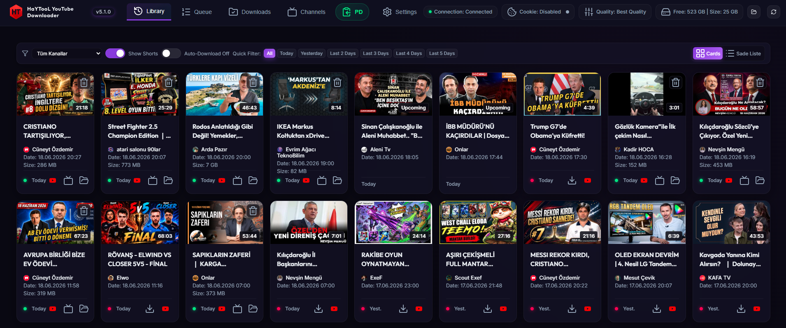
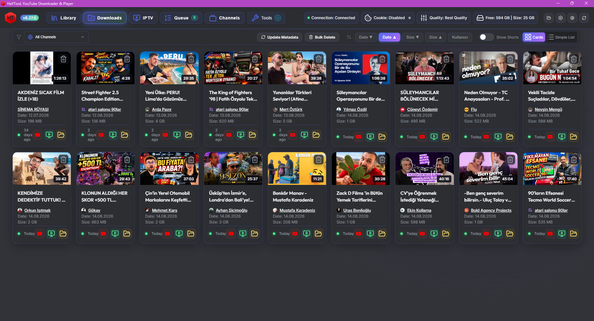
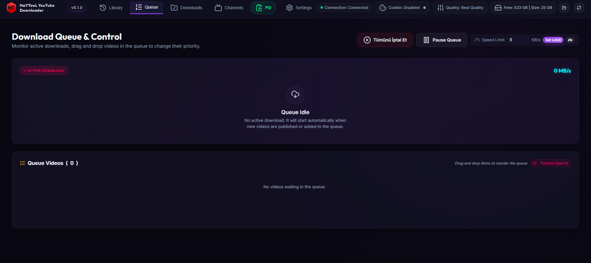
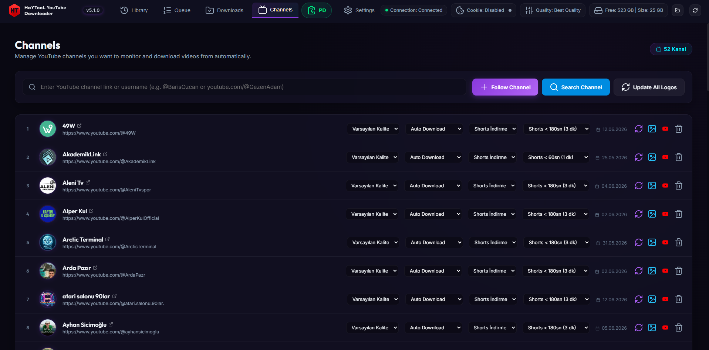
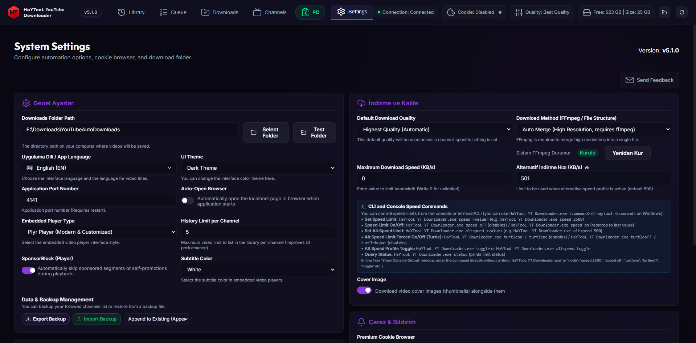

<p align="center">
  
</p>

# <p align="center">📥 HaYTooL - Algoritmasız Kişisel YouTube Kütüphanesi & Otomasyonu (v6.0.0)</p>

<p align="center">
  <b>Reclaim Your Feed: An Advanced, Portable, and Zero-Dependency YouTube Automation System</b><br/>
  <i>Algoritma Dayatmalarından Kurtulun: Gelişmiş, Taşınabilir ve Otomatik YouTube Takip & İndirme Sistemi</i>
</p>
<p align="center">
  
  
  
  
</p>

<p align="center">
  
  
  
  
</p>

---

## 🎯 Core Philosophy / Temel Felsefe

**English:**
YouTube's recommendation algorithms are designed to maximize watch time by pushing distracting, addictive, and unwanted content to your feed. **HaYTooL** is built to break this cycle. 
Instead of logging into YouTube and exposing your data to ads and algorithmic traps, **HaYTooL** acts as your private offline library. You define the exact channels you want to follow. The system continuously runs in the background, monitors their RSS feeds, and automatically downloads new videos as soon as they are uploaded. You watch your chosen content locally, 100% ad-free, offline, and entirely on your own terms.

**Türkçe:**
YouTube'un öneri algoritmaları, dikkatinizi dağıtmak, sizi platformda bağımlı kılmak ve istemediğiniz içerikleri önünüze çıkarmak üzerine tasarlanmıştır. **HaYTooL** bu dayatmayı yıkmak için geliştirildi.
YouTube'a girip reklam tuzağına ve algoritma önerilerine maruz kalmak yerine, **HaYTooL** size özel bağımsız bir kütüphane sunar. Sadece takip etmek istediğiniz kanalları belirlersiniz; sistem arka planda bu kanalları sürekli tarayarak yeni yüklenen videoları otomatik olarak yerel diskinize indirir. Size sadece kendi kütüphanenizden, reklamsız, çevrimdışı ve özgürce izlemek kalır.

---

<p align="center">
  <b>📸 Application Screenshots</b>
</p>
<p align="center">
  
  
</p>
<p align="center">
  
  
  
</p>

---

## 🚀 Key Features / Öne Çıkan Özellikler

### 🇬🇧 English:
* **Background Subscription Automation:** Periodically checks your followed channels via RSS feeds. Downloads new videos automatically the second they are uploaded, creating an offline, local cache of your subscription box.
* **Algorithmic Liberation:** No distraction, no "Up Next" traps, and no algorithmic rabbit holes. You only see the videos published by the creators you specifically subscribed to.
* **100% Ad-Free Local Playback:** Plays downloaded videos locally inside a custom dashboard using premium players (Artplayer, Plyr, or HTML5) with full seeking, speed control, and orientation-aware resizing.
* **SponsorBlock Integration:** Automatically skips sponsor segments, intros, outros, and subscription reminders. Includes a session-based shield toggle button under the player and dimmed segments on the timeline.
* **Advanced Subtitles & Translation:** Automatically grabs English/Turkish subtitles. Features a translation utility supporting 11 target languages with a visual loading overlay, along with customizable subtitle styling (12 colors, 12 background opacities, 13 font sizes).
* **YouTube-Style Split Playlist View:** The "Downloads" tab features a dual-column layout. Watch the active video on the left while browsing your other downloads in a sidebar playlist on the right, supporting autoplay (sequential video playback) and status HUD overlays.
* **Per-Channel Download Rules:** Customize download preferences for each channel individually: toggle auto-download, set duration filters, and allow/restrict downloading vertical YouTube Shorts.
* **Windows System Tray & Interactive Terminal Console:** Runs silently in the background with a Windows Tray Icon. Right-click to navigate, toggle speed limits, or control Discord activity. The console window features a command input field piping stdin controls directly (`ton`, `toff`, `status`, `pd <link>`).
* **Single-Instance Mutex Lock:** Prevents running multiple application processes. Launching a second instance prompts an alert, opens the active dashboard in your browser, and exits.
* **Discord Rich Presence (RPC):** Integrates directly with Discord using Windows Named Pipe IPC to display the watched video's channel name on the `details` line and the video title as the `state`. Can be toggled in settings and tray.
* **Dual-Boot isolated Configs:** Isolates OS-specific parameters (`configwin.ini` / `configunix.ini`). Prevents file loss on dual-boot setups; missing files are flagged as `fileMissing: true` and automatically restored if they reappear without breaking DB history.
* **Zero-Dependency Startup:** Pre-packaged with `node_modules/`, `yt-dlp/`, and `ffmpeg/`. Works fully out of the box without external setups.

### 🇹🇷 Türkçe:
* **Arka Planda Otomatik Kanal İzleme:** Takip listenizdeki kanalları RSS akışlarıyla sürekli denetler. Yeni bir video yüklenir yüklenmez arka planda otomatik olarak indirerek yerel abonelik kutunuzu oluşturur.
* **Algoritma Dayatmasından Kurtuluş:** Öneri algoritmaları, "Sıradaki Video" tuzakları ve dikkat dağıtıcı alakasız içerikler yok. Yalnızca takip etmek için kendi eklediğiniz yayıncıların videolarını görürsünüz.
* **%100 Reklamsız Yerel Oynatım:** İndirilen videoları arayüzdeki gelişmiş oynatıcılar (Artplayer, Plyr, HTML5) üzerinden sıfır gecikme, HTTP 206 Range desteği ve reklamsız olarak yerel diskinizden oynatır.
* **SponsorBlock Entegrasyonu:** Video içindeki sponsorlu alanları, intro/outro bölümlerini ve abonelik hatırlatıcılarını otomatik atlar. Oynatıcı altındaki kalkan (shield) butonuyla geçici olarak kapatılabilir.
* **Gelişmiş Altyazı ve Otomatik Çeviri:** İngilizce/Türkçe altyazıları otomatik indirir. Yerleşik çevirici modülüyle altyazıları 11 dile anlık çevirebilir ve altyazı rengini (12 renk), arka plan opaklığını (12 düzey), yazı boyutunu (13 seçenek) özelleştirebilirsiniz.
* **YouTube Tarzı Bölünmüş Çalma Listesi:** İndirilenler sekmesi iki sütunlu yerleşim sunar. Solda aktif video oynatılırken sağda indirilmiş diğer videoların çalma listesi listelenir; otomatik sonraki videoya geçiş (autoplay) ve ortada beliren cam tasarımlı durum HUD'ları desteklenir.
* **Kanala Özel İndirme Kuralları:** Her kanala özel ayarlar sunar: otomatik indirmeyi açıp kapatabilir, dikey Shorts videolarının indirilip indirilmeyeceğini belirleyebilirsiniz.
* **Windows Tepsi Uygulaması & İnteraktif Konsol:** Arka planda sessizce çalışır. Sağ tık menüsüyle hız profillerini, Discord durumunu yönetebilirsiniz. Konsol ekranındaki komut paneli üzerinden sunucuya doğrudan `ton`, `toff`, `status`, `pd <link>` komutları gönderebilirsiniz.
* **Tekil Örnek (Mutex) Koruması:** Uygulamanın birden fazla kez açılmasını engeller. İkinci kez açmaya çalıştığınızda çalışmakta olan portu tespit edip tarayıcıda arayüzü açar ve kendini kapatır.
* **Discord Durumu (Rich Presence) Entegrasyonu:** Windows Named Pipe IPC aracılığıyla izlediğiniz videonun kanal adını `details` satırında, video başlığını ise `state` satırında göstererek Discord profilinizde etkinlik olarak yansıtır.
* **Çift Önyükleme (Dual-Boot) Dosya Koruması:** Windows ve Linux üzerinde ayrı ayar dosyaları (`configwin.ini` / `configunix.ini`) tutar. Diskten silinen dosyaları geçmişten silmeden `fileMissing: true` işaretler ve dosya geri geldiğinde geçmişi bozmadan otomatik onarır.
* **Sıfır Bağımlılık (Zero-Dependency):** Gerekli tüm Node.js modülleri, `yt-dlp` ve `ffmpeg` binary dosyaları depo içinde hazır gelir. Hiçbir harici kuruluma gerek duymadan çift tıklamayla çalışır.

---

## 🛠️ Installation & Running / Kurulum ve Çalıştırma

Since all dependencies (`node_modules/`, `yt-dlp`, `ffmpeg`) are already pre-packaged in the repository, you can run the application immediately after downloading.
Tüm bağımlılıklar depo içerisinde hazır geldiğinden, indirdikten sonra doğrudan çalıştırabilirsiniz.

### 
* **Double-click Launch / Çift Tıklama ile Başlatma:**
  Double-click `HaYTooL YT Downloader.exe` in the root folder to start the application silently in the system tray and open the dashboard in your browser.
  *Kök dizindeki `HaYTooL YT Downloader.exe` dosyasına çift tıklayarak uygulamayı arka planda başlatabilir ve arayüzü tarayıcınızda açabilirsiniz.*
* **Command Line Launch / Komut Satırı ile Başlatma:**
  ```cmd
  "HaYTooL YT Downloader.exe"
  ```

###  /  (Unix)
1. **Make Launcher Executable / Çalıştırma İzni Verin:**
   ```bash
   chmod +x baslat.sh
   ```
2. **Start the Application / Uygulamayı Başlatın:**
   ```bash
   ./baslat.sh
   ```

Access the dashboard at / Arayüze şu adresten erişebilirsiniz: [http://localhost:4141](http://localhost:4141) *(default port can be changed in Settings / varsayılan port Ayarlar'dan değiştirilebilir)*.

---

## 🎹 Keyboard Shortcuts / Oynatıcı Klavye Kısayolları

When the video player is focused, you can control playback using standard shortcuts:
*Oynatıcı aktifken, aşağıdaki kısayollar ile oynatımı kontrol edebilirsiniz:*

* **`Space`** or **`k` / `K`**: Toggle play and pause / *Oynat - Duraklat*
* **`f` / `F`**: Toggle full screen / *Tam ekran modunu aç - kapat*
* **`m` / `M`**: Toggle mute / *Sesi aç - kapat*
* **`Arrow Right`**: Skip forward 5 seconds / *5 saniye ileri sar*
* **`Arrow Left`**: Skip backward 5 seconds / *5 saniye geri sar*
* **`l` / `L`**: Skip forward 10 seconds / *10 saniye ileri sar*
* **`j` / `J`**: Skip backward 10 seconds / *10 saniye geri sar*
* **`Arrow Up`**: Increase volume by 5% / *Sesi %5 artır*
* **`Arrow Down`**: Decrease volume by 5% / *Sesi %5 azalt*
* **`Home`**: Jump to the beginning / *Videonun en başına git*
* **`End`**: Jump to the end / *Videonun en sonuna git*
* **`>`** or **`Shift + .`**: Increase playback speed (up to 2x) / *Oynatma hızını artır*
* **`<`** or **`Shift + ,`**: Decrease playback speed / *Oynatma hızını azalt*
* **`0` to `9`**: Seek to a specific percentage (e.g., 5 jumps to 50%) / *Videonun yüzde dilimine atla*

---

## 💻 CLI & Console Commands / Komut Satırı Kontrolleri

You can manage speed profiles and queue downloads directly through the CLI or via the Console Input at the bottom of the Tray Log window:
*Hız sınırlarını ve indirmeleri terminalden veya Tepsi uygulamasının Konsol giriş satırından yönetebilirsiniz:*

* `status` - Shows current speed limits, active downloads, and queue info / *Hız limitlerini ve aktif kuyruk durumunu gösterir.*
* `ton` - Enables alternative speed limit (Turtle Mode) / *Alternatif hız sınırını (Kaplumbağa Modu) etkinleştirir.*
* `toff` - Disables alternative speed limit (Turtle Mode) / *Alternatif hız sınırını devre dışı bırakır.*
* `pd <youtube-url>` - Instantly adds the specified video to the download queue / *Belirtilen YouTube videosunu hemen indirme kuyruğuna ekler.*
* `clear` - Clears the terminal screen / *Konsol log ekranını temizler.*
* `help` - Shows the list of available commands / *Kullanılabilir komut listesini listeler.*

---

## 📂 Configuration Files / Yapılandırma Dosyaları

* **`configwin.ini`:** Windows-specific parameters (download path, port, alternative speed toggle).
* **`configunix.ini`:** Linux/macOS-specific parameters.
* **`channels.ini`:** Monitored channels list and their download rules.
* **`db.json`:** Lightweight local database storing download history, queue state, and metadata.

---

## 📞 Support & Feedback / Destek ve İletişim

📧 **korazhayto@gmail.com**  
*Developer & Designer / Geliştirici & Tasarımcı:* **HaYTo**
